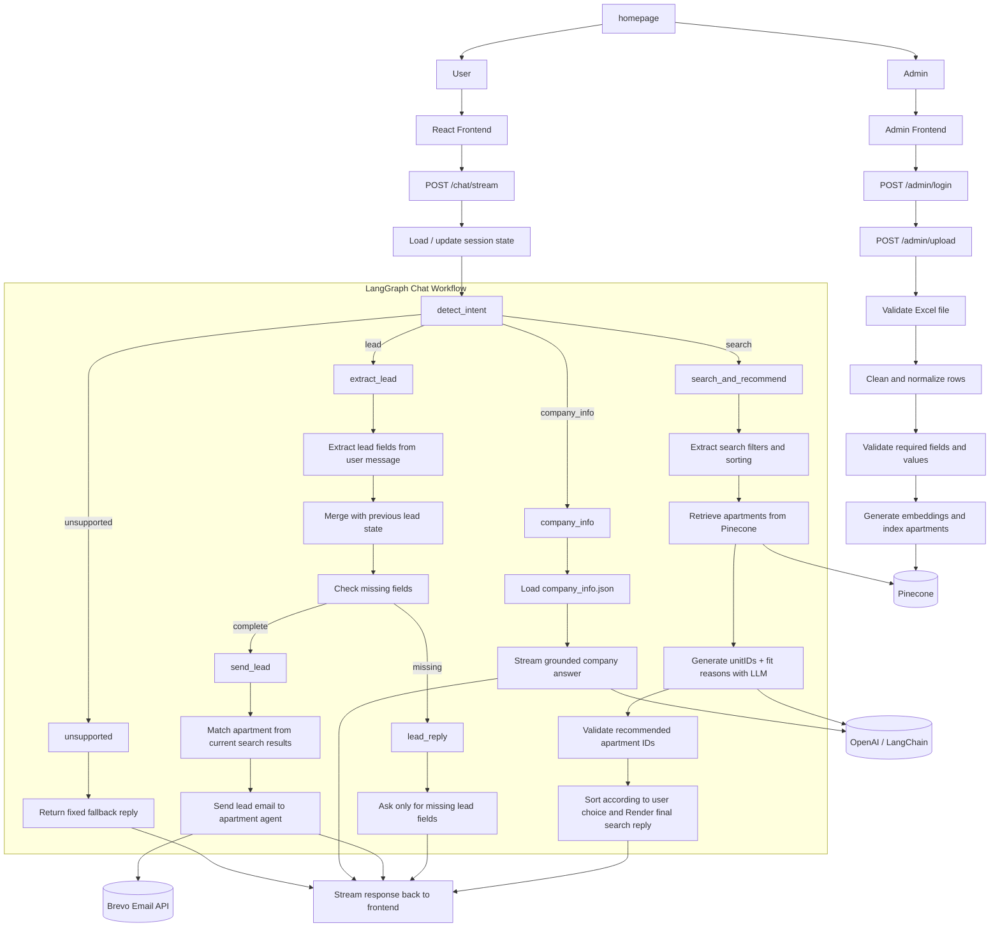
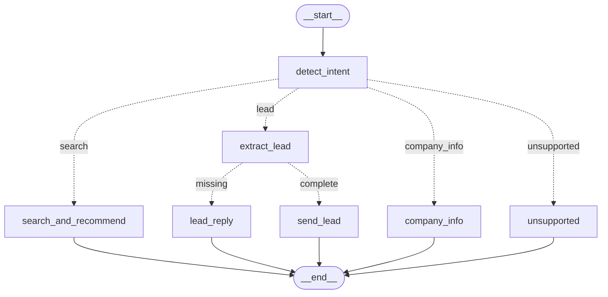

# Dorra Real Estate Assistant

A full-stack real estate assistant for **Dorra** that supports three main flows in one chat interface:

- **Apartment search** with natural-language filters and user-controlled sorting
- **Lead collection** across multiple turns, followed by agent email handoff
- **Company information** answers grounded in Dorra company data, with live streaming

The project also includes an **admin upload flow** for Excel apartment data, validation before indexing, and Docker support for running both backend and frontend.

## Assignment Coverage

This project includes:
- FastAPI backend
- LangChain + Pinecone RAG pipeline
- LangGraph workflow orchestration
- Multi-turn lead collection
- Agent email handoff
- React frontend
- Admin Excel upload and validation
- A sample data as an excel file for testing
- README setup instructions
- Docker support
- Live Demo Deployment
- Bonus: Streaming AI responses
- Bonus: apartment ranking
- Bonus: LangSmith observability
---

## Live Demo

- **Live App Link:** `Add deployed app link here`
- **Demo Video Link:** `Add video link here if available`

>This live demo was held on Render by creating a backend web-service and a frontend static site

>I am using the free tier of Render so give it some time to load the project for the first time since it deploys it from the beginning

---

## Table of Contents

- [Tech Stack](#tech-stack)
- [Core Features](#core-features)
- [Supported Intents](#supported-intents)
- [Project Structure](#project-structure)
- [Prerequisites](#prerequisites)
- [Setup Instructions](#setup-instructions)
- [How to Use the Application](#how-to-use-the-application)
- [API Overview](#api-overview)
- [System Architecture](#system-architecture)
- [System Flow](#system-flow)
- [Retrieval Pipeline](#retrieval-pipeline)
- [Streaming Behavior](#streaming-behavior)
- [Validation and Safety Measures](#validation-and-safety-measures)
- [Workflow Graph](#workflow-graph)
- [Design Choices](#design-choices)
- [LangSmith Tracing and Debugging](#langsmith-tracing-and-debugging)
- [Sample Dataset](#sample-dataset)
- [Admin Access](#admin-access)
- [Limitations](#limitations)
- [Future Improvements](#future-improvements)

---

## Tech Stack

### Backend
- FastAPI
- LangGraph
- LangChain + OpenAI
- Pinecone
- Pandas
- Brevo email API
- LangSmith tracing

### Frontend
- React
- Vite
- React Router

### Infrastructure / Dev Tools
- Docker
- Docker Compose

---

## Core Features

### 1. Apartment Search
The user can search in natural language, for example:

- `I want a 2-bedroom apartments in New Cairo under 4 million ordered by prices descendingly`
- `Show me apartments in Sheikh Zayed, biggest area first`
- `Cheapest townhouse in October`

The system:
- extracts structured filters from the user message
- queries Pinecone using embeddings + metadata filters
- asks the LLM to generate short fit reasons for retrieved apartments only and judge whether they are a good fit or not
- validates the LLM output against retrieved apartment IDs before rendering
- returns a formatted response sorted according to the user’s requested ranking

### 2. Lead Flow
If the user shows interest in a property or starts sharing contact information, the chatbot switches into a lead flow.

It can collect the following fields across multiple turns:
- apartment ID
- name
- phone
- email
- preferred contact time

If something is missing, it asks only for the missing fields and keeps asking till the user satisfy all the requirments.
When all required fields are available, it sends the lead to the responsible agent by email.

### 3. Company Information
If the user asks about Dorra itself, the chatbot answers using company information loaded from `company_info.json`.

`The ai response is streamed live` so the frontend receives chunks as the model generates them.

### 4. Unsupported Messages Guardrail
If the message is outside the supported intents, the chatbot returns a fixed fallback reply instead of trying to answer unrelated requests.

### 5. Admin Upload
An authenticated admin can upload an Excel file of apartments.

The backend:
- validates required columns
- cleans and normalizes the data
- validates row values
- indexes valid apartments into Pinecone

---

## Supported Intents

The chat workflow supports four internal paths to go in (intents):

- `search`
- `lead`
- `company_info`
- `unsupported`

---

## Project Structure

```text
project-root/
├── app/
│   ├── api/
│   │   ├── admin.py
│   │   └── chat.py
│   ├── core/
│   │   └── config.py
│   ├── graph/
│   │   ├── state.py
│   │   └── workflow.py
│   └── services/
│       ├── detect_intent.py
│       ├── email_gen.py
│       ├── index_file.py
│       ├── lead_prepare.py
│       ├── llm_chatbot.py
│       └── validate_file.py
├── company_info.json
├── requirements.txt
├── Dockerfile
├── docker-compose.yml
├── .dockerignore
├── .env
├── appartments.xlsx
└── frontend/
    ├── src/
    ├── package.json
    ├── vite.config.js
    ├── Dockerfile
    └── .dockerignore
```

---

## Prerequisites

Make sure you have the following installed before running the project:

- Python 3.11+
- Node.js 20+
- Docker Desktop (if using Docker)
- An OpenAI API key
- A Pinecone account and API key

You will also need a Brevo account, API key, and verified sender email if you want to test the email handoff flow.

---

## Setup Instructions

## 1. Clone the repository

```bash
git clone https://github.com/AhmedAshraf4/Apartment-Recommendation-Chatbot.git
cd Apartment-Recommendation-Chatbot
```

## 2. Create the `.env` file

Create a `.env` file in the project root.

Example:

```env
OPENAI_API_KEY=your_openai_api_key
OPENAI_MODEL=gpt-4.1-mini
OPENAI_EMBEDDING_MODEL=text-embedding-3-small

PINECONE_API_KEY=your_pinecone_api_key
PINECONE_INDEX_NAME=dorra-apartments
PINECONE_CLOUD=aws
PINECONE_REGION=us-east-1

FRONTEND_ORIGIN=http://localhost:5173
SESSION_SECRET=replace_with_a_secret_key

ADMIN_USERNAME=admin
ADMIN_PASSWORD=admin123

BREVO_API_KEY=your_brevo_api_key
BREVO_FROM_EMAIL=your_verified_sender_email
BREVO_FROM_NAME=Dorra AI Assistant

LANGCHAIN_API_KEY=optional_if_using_langsmith
LANGCHAIN_TRACING_V2=true
LANGCHAIN_PROJECT="dorra"
```

> The exact environment variable names should match the names expected in `app/core/config.py`.

## 3. Make sure `company_info.json` exists

The backend loads company information from:

```text
company_info.json
```

Place this file in the **project root**.

## 4. Choose one of the following run options

You can run the project in one of two ways:

- **Option A: Docker**
- **Option B: Local development**

---

## Option A: Run with Docker

This is the easiest way to run both backend and frontend together.

### Start everything

From the project root:

```bash
docker compose up --build
```

This starts:
- backend on `http://localhost:8000`
- frontend on `http://localhost:5173`

### Stop everything

```bash
docker compose down
```

---

## Option B: Run Locally

### 1. Create a virtual environment

#### Windows
```bash
python -m venv .venv
.venv\Scripts\activate
```

#### macOS / Linux
```bash
python -m venv .venv
source .venv/bin/activate
```

### 2. Install backend dependencies

```bash
pip install -r requirements.txt
```

### 3. Install frontend dependencies

```bash
cd frontend
npm install
cd ..
```

### 4. Run the backend

From the project root:

```bash
uvicorn app.main:app --reload
```

Backend will run at:

```text
http://localhost:8000
```

### 5. Run the frontend

In a second terminal:

```bash
cd frontend
npm run dev
```

Frontend will run at:

```text
http://localhost:5173
```

---

## How to Use the Application

## 1. Search for apartments
Try messages like:

- `I need a 3-bedroom apartment in New Cairo under 8 million`
- `Show me apartments in Sheikh Zayed sorted by area descending`
- `Cheapest penthouse in October`

### Sorting behavior
The user can include sorting directly in the same prompt.

Supported sorting:
- `price asc`
- `price desc`
- `area asc`
- `area desc`

Examples:
- `cheapest first`
- `highest price first`
- `biggest area first`
- `smallest area first`

If the user does not specify sorting, the default is:
- **price ascending**

## 2. Submit a lead
Examples:

- `I am interested in ap003`
- `My name is Ahmed`
- `My phone is 01012345678`
- `Please contact me after 6 pm`

The chatbot will continue collecting missing fields until the lead is complete.

## 3. Ask about the company
Examples:

- `Tell me about Dorra`
- `What is Dorra's hotline?`
- `Where is Dorra located?`

---

## API Overview

## Admin Routes

### `POST /admin/login`
Admin login using username and password.

### `GET /admin/me`
Check current admin session.

### `POST /admin/logout`
Log out admin.

### `POST /admin/upload`
Upload an Excel file of apartments.
Requires admin authentication.

## Chat Routes

### `POST /chat/stream`
Main chat endpoint used by the frontend.
Streams the reply incrementally.

## Health Route

### `GET /health`
Basic health check.

---

## System Architecture

> If Mermaid diagrams are not rendered in your viewer, open this README on GitHub to view the workflow graph properly.




---

## System Flow

### Search Flow
1. User sends a natural-language apartment request.
2. Intent is classified as `search`.
3. Filters and sorting preferences are extracted.
4. Pinecone is queried using embeddings + metadata filters.
5. Retrieved apartments are **sorted according to user preference**.
6. The LLM generates fit reasons only for retrieved apartments that fits the query and returns:
```
collection[
    {
      "apartment_id": "ap009",
      "fit_reason": "This fully finished apartment offers a spacious layout and immediate occupancy in a well-serviced compound."
    },
    {
      "apartment_id": "ap003",
      "fit_reason": "This ready-to-move apartment features modern amenities in a prestigious residential compound."
    }
    ...
]
```
7. The output is validated against real apartment IDs to avoid any halucinations by the LLM.
8. Final response is rendered by merging the rest of the appartment data to the validated ids and streamed to the UI with a typing effect.

### Lead Flow
1. User expresses interest or shares contact information.
2. Intent is classified as `lead`.
3. Lead information is extracted from the message.
4. New lead data is merged with previous lead state.
5. Missing fields are detected.
6. If data is incomplete, the bot asks only for the missing fields.
7. Bot keeps asking till data gets completed
8. If complete, the lead email is sent to the apartment agent.

### Company Info Flow
1. User asks about Dorra.
2. Intent is classified as `company_info`.
3. Company data is loaded from `company_info.json`.
4. The LLM streams the answer while LangGraph controls the flow.
5. Chunks are streamed to the frontend immediately.

### Unsupported Flow
1. User asks something unrelated to the supported use cases.
2. Intent is classified as `unsupported`.
3. A fixed fallback reply is returned.

---

## Streaming Behavior

The project uses two response styles:

### 1. True LLM streaming
Used for **company info**.
The response is streamed chunk by chunk as the model generates it.

### 2. Simulated typing effect
Used for **search** and **lead** replies.
The final text is split into smaller pieces before being sent to the frontend to keep the streamed response feel. Streaming is not used here because the llm output needed to be collected as a whole and validated first as the case of searh where we check that the LLM response IDs are actually present in the retrieved IDs and then the rest of the information about the unit is parsed with the ID and the fit_reason generated by the LLM and then the response is rendered before getting pushed to the frontend.


---
## Retrieval Pipeline

The recommendation flow uses a retrieval pipeline to make sure apartment suggestions are grounded in the indexed dataset rather than relying only on the LLM.

### How retrieval works
1. The user sends a natural-language apartment request.
2. The system extracts structured filters from the message, such as:
   - property type
   - city
   - bedrooms
   - bathrooms
   - price range
   - view
   - sorting preference
3. The full user query is converted into an embedding using OpenAI embeddings.
4. Pinecone is queried using:
   - semantic similarity from the query embedding
   - metadata filters for structured fields like city, bedrooms, bathrooms, and price range
5. Retrieved apartments are checked again for view matching when needed.
6. The retrieved apartments are then sorted according to the user’s requested ranking:
   - price ascending or descending
   - area ascending or descending
7. The retrieved apartments view is checked if it contains some words for instance "garden" will be a hit if the view in record was "garden view". This was done in the code since pinecone doesnt support that
8. The top retrieved apartments are passed to the LLM only to generate fit reasons and decide which of the retrieved apartments best fit the request.

### Why this retrieval setup was used
Using retrieval keeps the recommendation process grounded in actual apartment data from the indexed dataset. This makes the chatbot more reliable and reduces the chance of the model inventing properties that do not exist.

The system combines:
- **semantic search**, which helps match the overall meaning of the user request
- **metadata filtering**, which enforces structured conditions like city, bedroom count, bathroom count, and price range

This combination makes the search both flexible and precise.

### Final grounding step
After retrieval and LLM reasoning, the returned apartment IDs are validated against the actual retrieved Pinecone results before rendering the final response. The apartment information shown to the user comes from the indexed metadata, while the LLM is only used for fit reasoning and response phrasing.

---
## Validation and Safety Measures

### Search validation
The recommendation stage is not allowed to invent apartments IDs or information.
Returned apartment IDs are validated against the actual retrieved Pinecone results before rendering and the actual information of the appartment is taken from the retrieval by matching IDs from the LLM and IDs in the retrieval and taking their metadata to append it in the response to prevent any halusinations.

### Lead validation
The lead flow checks for missing required fields before sending an email.

### Upload validation
Uploaded Excel files are validated for:
- required columns
- text cleanup and normalization
- numeric validity
- non-negative numeric values
- valid agent email format

### Unsupported guardrail
Requests outside the supported intents are handled with a fixed reply.

---

## Workflow Graph

> If Mermaid diagrams are not rendered in your viewer, open this README on GitHub to view the workflow graph properly.



---

## Design Choices

### Why Pinecone?
Pinecone is used for semantic apartment retrieval, combined with metadata filtering for structured conditions like city, bedrooms, and price range.

### Why validate LLM output?
The LLM only generates fit reasons and unit IDs, but final apartment facts come from the indexed data. This reduces hallucination risk in the recommendation response.

### Why use both real streaming and chunked UI streaming?
Because the project needs two different behaviors:
- live model streaming for company-info answers
- controlled UI typing effect for search and lead responses

Since some responses needed to be validated from the LLM first

### Why this architecture works for the task
This architecture balances flexibility and safety. Retrieval through Pinecone grounds the recommendation process in real apartment data, LangGraph keeps the multi-flow chatbot behavior explicit and manageable, validation reduces the risk of hallucinated apartment recommendations, and the admin upload pipeline keeps the indexed dataset maintainable and easy to refresh.

---

## LangSmith Tracing and Debugging

LangSmith was used during development to trace, inspect, and debug the full chatbot workflow end to end. It helped track the main stages of the system, including intent detection, apartment retrieval from Pinecone, LLM-based recommendation generation, validation of recommended apartment IDs, lead-data extraction and merging, email-sending flow, and company-info streaming.

This was especially useful for verifying that LangGraph routing was correct, checking that retrieved apartment data was passed properly between steps, and catching cases where the model output was valid in isolation but was not being forwarded correctly to the frontend. In practice, LangSmith served as the main observability and debugging tool for understanding how the chatbot behaved internally across different user flows.

---

## Sample Dataset

A sample Excel dataset is included in the repository as:

```text
appartments.xlsx
```

This file can be uploaded through the admin flow and is used to populate the apartment index.

> Data from this file was scraped from Propertyfinder realestate website then used an LLM to organize them

Columns in the dataset:

**apartment_id**  
A unique identifier for each property listing. This helps distinguish one apartment from another.

**title**  
The type or category of the property, such as apartment or studio.

**city**  
The city where the property is located, such as New Cairo, East Cairo, or Madinaty.

**area**  
The name of the compound, district, or residential project where the property is situated.

**location**  
The full location description of the property, usually including the compound, district, and city.

**bedrooms**  
The number of bedrooms available in the property.

**bathrooms**  
The number of bathrooms included in the property.

**area_sqm**  
The total size of the property measured in square meters.

**view**  
A short description of what the property overlooks, such as a garden view, lake view, or compound view.

**price**  
The sale price of the property.

**amenities**  
A list of facilities and services available in the property or compound, such as parking, swimming pools, security, gardens, and commercial areas.

**description**  
A detailed summary of the property, including its finishing, layout, special features, and the advantages of its location or compound.

**agent_email**  
The contact email address for the agent or person responsible for the listing.

---

## Admin Access

Admin authentication is configured through environment variables in `.env`:

- `ADMIN_USERNAME`
- `ADMIN_PASSWORD`

Example from the sample environment configuration:

```env
ADMIN_USERNAME=admin
ADMIN_PASSWORD=admin123
```
---

## Limitations

- The admin session is stored in application memory/session middleware and is not designed for production-grade auth.
- Frontend session memory is in-memory on the backend and may reset if the server restarts.
- The company info flow only knows what is present in `company_info.json`.

---

## Future Improvements

- Persistent session storage instead of in-memory state
- Better admin authentication
- Richer reranking logic beyond price and area
- More advanced lead CRM integration
- Better analytics around search behavior and conversions
- Arabic integration for the chatbot
