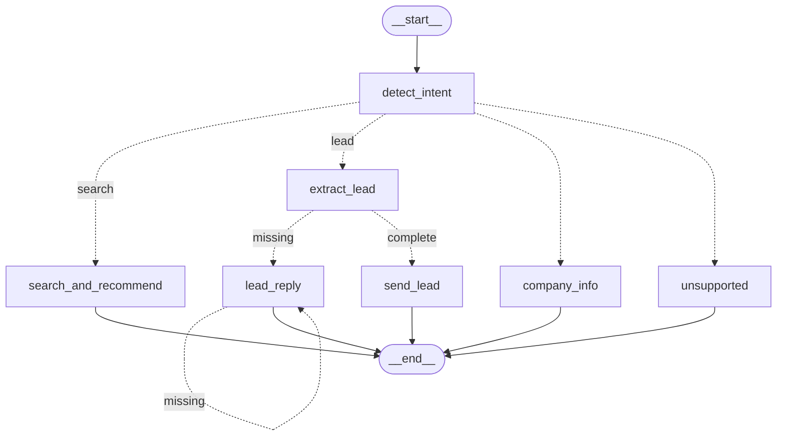

# Dorra Real Estate Assistant

A full-stack real estate assistant for **Dorra** that supports three main flows in one chat interface:

- **Apartment search** with natural-language filters and user-controlled sorting
- **Lead collection** across multiple turns, followed by agent email handoff
- **Company information** answers grounded in Dorra company data, with live streaming

The project also includes an **admin upload flow** for Excel apartment data, validation before indexing, and Docker support for running both backend and frontend.

This deliverable satisfied all the core requirments of the project + the bonus requirments as well

---

## Table of Contents

- [Tech Stack](#tech-stack)
- [Core Features](#core-features)
- [Supported Intents](#supported-intents)
- [Project Structure](#project-structure)
- [Setup Instructions](#setup-instructions)
- [Running the Project Locally](#running-the-project-locally)
- [Running with Docker](#running-with-docker)
- [How to Use the Application](#how-to-use-the-application)
- [API Overview](#api-overview)
- [System Flow](#system-flow)
- [Streaming Behavior](#streaming-behavior)
- [Validation and Safety Measures](#validation-and-safety-measures)
- [Workflow Graph](#workflow-graph)
- [Design Choices](#design-choices)
- [LangSmith Tracing and Debugging](#langsmith-tracing-and-debugging)
- [Limitations](#limitations)
- [Future Improvements](#future-improvements)

---

## Tech Stack

### Backend
- FastAPI
- LangGraph
- LangChain + OpenAI
- Pinecone
- Pandas
- SMTP email sending
- LangSmith tracing

### Frontend
- React
- Vite
- React Router

### Infrastructure / Dev Tools
- Docker
- Docker Compose

---

## Core Features

### 1. Apartment Search
The user can search in natural language, for example:

- `I want a 2-bedroom apartments in New Cairo under 4 million ordered by prices descendingly`
- `Show me apartments in Sheikh Zayed, biggest area first`
- `Cheapest townhouse in October`

The system:
- extracts structured filters from the user message
- queries Pinecone using embeddings + metadata filters
- asks the LLM to generate short fit reasons for retrieved apartments only and judge whether they are a good fit or not
- validates the LLM output against retrieved apartment IDs before rendering
- returns a formatted response sorted according to the user’s requested ranking

### 2. Lead Flow
If the user shows interest in a property or starts sharing contact information, the chatbot switches into a lead flow.

It can collect the following fields across multiple turns:
- apartment ID
- name
- phone
- email
- preferred contact time

If something is missing, it asks only for the missing fields and keeps asking till the user satisfy all the requirments.
When all required fields are available, it sends the lead to the responsible agent by email.

### 3. Company Information
If the user asks about Dorra itself, the chatbot answers using company information loaded from `company_info.json`.

`The ai response is streamed live` so the frontend receives chunks as the model generates them.

### 4. Unsupported Messages Guardrail
If the message is outside the supported intents, the chatbot returns a fixed fallback reply instead of trying to answer unrelated requests.

### 5. Admin Upload
An authenticated admin can upload an Excel file of apartments.

The backend:
- validates required columns
- cleans and normalizes the data
- validates row values
- indexes valid apartments into Pinecone

---

## Supported Intents

The chat workflow supports four internal paths to go in (intents):

- `search`
- `lead`
- `company_info`
- `unsupported`

---

## Project Structure

```text
project-root/
├── app/
│   ├── api/
│   │   ├── admin.py
│   │   └── chat.py
│   ├── core/
│   │   └── config.py
│   ├── graph/
│   │   ├── state.py
│   │   └── workflow.py
│   └── services/
│       ├── detect_intent.py
│       ├── email_gen.py
│       ├── index_file.py
│       ├── lead_prepare.py
│       ├── llm_chatbot.py
│       └── validate_file.py
├── company_info.json
├── requirements.txt
├── Dockerfile
├── docker-compose.yml
├── .dockerignore
├── .env
├── appartments.xlsx
└── frontend/
    ├── src/
    ├── package.json
    ├── vite.config.js
    ├── Dockerfile
    └── .dockerignore
```

---

## Setup Instructions

## 1. Clone the repository

```bash
git clone https://github.com/AhmedAshraf4/Apartment-Recommendation-Chatbot.git
cd Apartment-Recommendation-Chatbot
```

## 2. Create a virtual environment

### Windows
```bash
python -m venv .venv
.venv\Scripts\activate
```

### macOS / Linux
```bash
python -m venv .venv
source .venv/bin/activate
```

## 3. Install backend dependencies

```bash
pip install -r requirements.txt
```

## 4. Install frontend dependencies

```bash
cd frontend
npm install
cd ..
```

## 5. Create the `.env` file

Create a `.env` file in the project root.

Example:

```env
OPENAI_API_KEY=your_openai_api_key
OPENAI_MODEL=gpt-4.1-mini
OPENAI_EMBEDDING_MODEL=text-embedding-3-small

PINECONE_API_KEY=your_pinecone_api_key
PINECONE_INDEX_NAME=dorra-apartments
PINECONE_CLOUD=aws
PINECONE_REGION=us-east-1

FRONTEND_ORIGIN=http://localhost:5173
SESSION_SECRET=replace_with_a_secret_key

ADMIN_USERNAME=admin
ADMIN_PASSWORD=admin123

SMTP_HOST=smtp.gmail.com
SMTP_PORT=587
SMTP_USER=your_smtp_user
SMTP_PASSWORD=your_smtp_password
SMTP_FROM=your_from_email

LANGCHAIN_API_KEY=optional_if_using_langsmith
LANGCHAIN_TRACING_V2=true
LANGCHAIN_PROJECT="dorra"
```

> The exact environment variable names should match the names expected in `app/core/config.py`.

## 6. Make sure `company_info.json` exists

The backend loads company information from:

```text
company_info.json
```

Place this file in the **project root**.

---

## Running the Project Locally

## 1. Run the backend

From the project root:

```bash
uvicorn app.main:app --reload
```

Backend will run at:

```text
http://localhost:8000
```

## 2. Run the frontend

In a second terminal:

```bash
cd frontend
npm run dev
```

Frontend will run at:

```text
http://localhost:5173
```

---

## Running with Docker

This project includes Docker support for both backend and frontend.

## Files used

### In project root
- `Dockerfile`
- `.dockerignore`
- `docker-compose.yml`

### In `frontend/`
- `Dockerfile`
- `.dockerignore`

## Run everything

From the project root:

```bash
docker compose up --build
```

This starts:
- backend on `http://localhost:8000`
- frontend on `http://localhost:5173`

## Stop everything

```bash
docker compose down
```

---

## How to Use the Application

## 1. Search for apartments
Try messages like:

- `I need a 3-bedroom apartment in New Cairo under 8 million`
- `Show me apartments in Sheikh Zayed sorted by area descending`
- `Cheapest penthouse in October`

### Sorting behavior
The user can include sorting directly in the same prompt.

Supported sorting:
- `price asc`
- `price desc`
- `area asc`
- `area desc`

Examples:
- `cheapest first`
- `highest price first`
- `biggest area first`
- `smallest area first`

If the user does not specify sorting, the default is:
- **price ascending**

## 2. Submit a lead
Examples:

- `I am interested in ap003`
- `My name is Ahmed`
- `My phone is 01012345678`
- `Please contact me after 6 pm`

The chatbot will continue collecting missing fields until the lead is complete.

## 3. Ask about the company
Examples:

- `Tell me about Dorra`
- `What is Dorra's hotline?`
- `Where is Dorra located?`

---

## API Overview

## Admin Routes

### `POST /admin/login`
Admin login using username and password.

### `GET /admin/me`
Check current admin session.

### `POST /admin/logout`
Log out admin.

### `POST /admin/upload`
Upload an Excel file of apartments.
Requires admin authentication.

## Chat Routes

### `POST /chat/stream`
Main chat endpoint used by the frontend.
Streams the reply incrementally.

## Health Route

### `GET /health`
Basic health check.

---

## System Flow

### Search Flow
1. User sends a natural-language apartment request.
2. Intent is classified as `search`.
3. Filters and sorting preferences are extracted.
4. Pinecone is queried using embeddings + metadata filters.
5. Retrieved apartments are **sorted according to user preference**.
6. The LLM generates fit reasons only for retrieved apartments that fits the query and returns:
```
collection[
    {
      "apartment_id": "ap009",
      "fit_reason": "This fully finished apartment offers a spacious layout and immediate occupancy in a well-serviced compound."
    },
    {
      "apartment_id": "ap003",
      "fit_reason": "This ready-to-move apartment features modern amenities in a prestigious residential compound."
    }
    ...
]
```
7. The output is validated against real apartment IDs to avoid any halucinations by the LLM.
8. Final response is rendered by merging the rest of the appartment data to the validated ids and streamed to the UI with a typing effect.

### Lead Flow
1. User expresses interest or shares contact information.
2. Intent is classified as `lead`.
3. Lead information is extracted from the message.
4. New lead data is merged with previous lead state.
5. Missing fields are detected.
6. If data is incomplete, the bot asks only for the missing fields.
7. Bot keeps asking till data gets completed
8. If complete, the lead email is sent to the apartment agent.

### Company Info Flow
1. User asks about Dorra.
2. Intent is classified as `company_info`.
3. Company data is loaded from `company_info.json`.
4. The LLM streams the answer while LangGraph controls the flow.
5. Chunks are streamed to the frontend immediately.

### Unsupported Flow
1. User asks something unrelated to the supported use cases.
2. Intent is classified as `unsupported`.
3. A fixed fallback reply is returned.

---

## Streaming Behavior

The project uses two response styles:

### 1. True LLM streaming
Used for **company info**.
The response is streamed chunk by chunk as the model generates it.

### 2. Simulated typing effect
Used for **search** and **lead** replies.
The final text is split into smaller pieces before being sent to the frontend to keep the streamed response feel. Streaming is not used here because the llm output needed to be collected as a whole and verified first before getting pushed to the frontend. 

>AI streaming of responses is done only in the case of company info flow since in the other flows the response of the AI is validated and parsed first before pushing it to the frontend so it much be fully recieved to start validation before pushing
---

## Validation and Safety Measures

### Search validation
The recommendation stage is not allowed to invent apartments IDs or information.
Returned apartment IDs are validated against the actual retrieved Pinecone results before rendering and the actual information of the appartment is taken from the retrieval by matching IDs from the LLM and IDs in the retrieval and taking their metadata to append it in the response to prevent any halusinations.

### Lead validation
The lead flow checks for missing required fields before sending an email.

### Upload validation
Uploaded Excel files are validated for:
- required columns
- text cleanup and normalization
- numeric validity
- non-negative numeric values
- valid agent email format

### Unsupported guardrail
Requests outside the supported intents are handled with a fixed reply.

---

## Workflow Graph



---

## Design Choices

### Why LangGraph?
LangGraph is used to keep the chatbot flow explicit and stateful.
It makes it easier to separate and manage:
- search flow
- lead flow
- company info flow
- unsupported fallback flow

### Why Pinecone?
Pinecone is used for semantic apartment retrieval, combined with metadata filtering for structured conditions like city, bedrooms, and price range.

### Why validate LLM output?
The LLM only generates fit reasons and ordering context, but final apartment facts come from the indexed data. This reduces hallucination risk in the recommendation response.

### Why use both real streaming and chunked UI streaming?
Because the project needs two different behaviors:
- live model streaming for company-info answers
- controlled UI typing effect for search and lead responses

Since some responses needed to be validated from the LLM first

---

## LangSmith Tracing and Debugging

LangSmith was used during development to trace, inspect, and debug the full chatbot workflow end to end. It helped track the main stages of the system, including intent detection, apartment retrieval from Pinecone, LLM-based recommendation generation, validation of recommended apartment IDs, lead-data extraction and merging, email-sending flow, and company-info streaming.

This was especially useful for verifying that LangGraph routing was correct, checking that retrieved apartment data was passed properly between steps, and catching cases where the model output was valid in isolation but was not being forwarded correctly to the frontend. In practice, LangSmith served as the main observability and debugging tool for understanding how the chatbot behaved internally across different user flows.

---
## Limitations

- The admin session is stored in application memory/session middleware and is not designed for production-grade auth.
- Frontend session memory is in-memory on the backend and may reset if the server restarts.
- The company info flow only knows what is present in `company_info.json`.

---

## Future Improvements

- Persistent session storage instead of in-memory state
- Better admin authentication
- Richer reranking logic beyond price and area
- More advanced lead CRM integration
- Better analytics around search behavior and conversions
- Arabic integration for the chatbot


